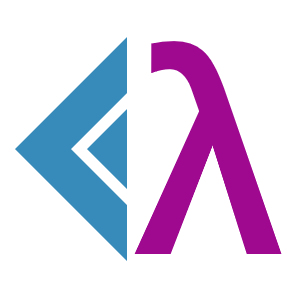

<p align="center">

</p>
<p align="center">  
<h1 align="center">λ calculus in F#</h1>
</p>
<p align="center">
    <i>
        Library for lambda calculus made purely in and for F#
    </i>
</p>

> The λ-calculus is, at heart, a simple notation for functions and application. The main ideas are applying a function to an argument and forming functions by abstraction. Despite its sparse syntax, the expressiveness and flexibility of the λ-calculus make it a cornucopia of logic and mathematics. [**(c)**](https://plato.stanford.edu/entries/lambda-calculus/)

The library serves no production purpose and made exclusively out of academic interest. It has a [web app](https://whiteblackgoose.github.io/LambdaCalculusFSharp/) made for demonstration.

## Syntax of λ-calculus

Rules:
- Variables are single-character lower-case Latin letters.
- Lambda starts with `\`, then is followed by 1 or more variable, then a dot (`.`), then expression.
- Associativity is left-sided: `xyz` is `(xy)z`.
- A nested lambda can be shortcuted: `\x.\y.\z.xyz` is the same as `\xyz.xyz`.
- Symbol `λ` can be used instead of `\`, but is not essential.

Examples:
- `x` - an expression of one free variable x
- `xy` - `y` applied to `x`
- `\x.x` - an identity
- `\x.xx` - a lambda which returns its only parameter applied to itself
- `(\x.x)y` - `y` applied to identity (will return `y` after beta reduction)
- `(\x.xx)(\x.xx)` - simple example of beta-irreducible expression

## Library API

Expression is defined as following:
```fs
type Expression =
    | Variable of char
    | Lambda of Head : Variable * Body : Expression
    | Applied of Lambda : Expression * Argument : Expression
```
in `LambdaCalculus.Atoms`.

In the same module `LambdaCalculus.Atoms` there are 
- `betaReduce` or `βReduce`: `Expression -> Expression` performs beta-reduction, that is, simplification of an expression
(starting from bottom, replaces parameters of lambdas in their bodies with the applied expressions)
- `alphaEqual` or `αEqual`: `Expression -> Expression -> Expression` compares two expressions up to lambdas parameter names
- `substitute`: `char -> Expression -> Expression -> Expression` replaces the given variable with a given expression. In case
of conflicts between it and a local variable in a lambda, it will alpha-convert the lambda's parameter to a new name.

In the module `LambdaCalculus.Parsing` there is `parse` which takes a string as an argument, and returns a `Result` of
`Expression` and `string`.

## Fun facts

The library is made in pure functional programming. Even the parser has no exceptions, early returns, for-loops.
The logic is implemented with recursion, pattern matching, and computation expressions.
